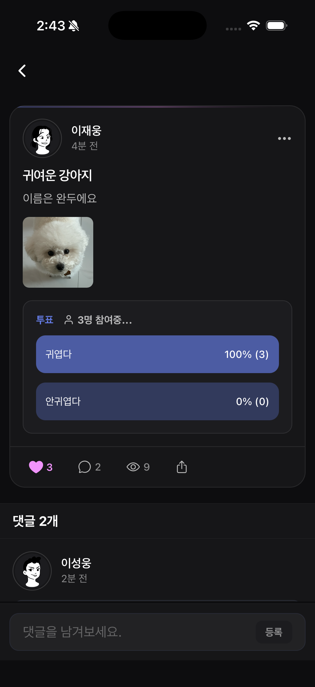
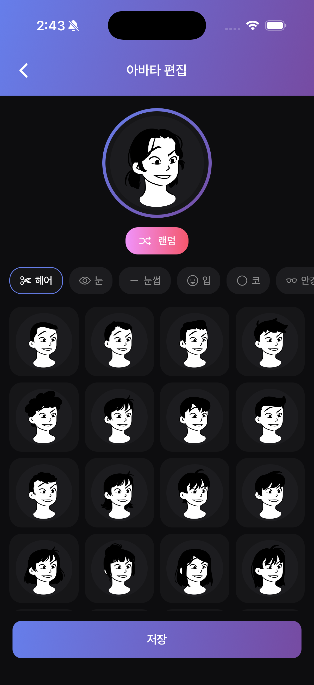

# Community App

React Native와 Expo로 구축한 소셜 커뮤니티 모바일 애플리케이션


## 목차

- [스크린샷](#스크린샷)
- [주요 기능](#주요-기능)
- [기술 스택](#기술-스택)
- [아키텍처 하이라이트](#아키텍처-하이라이트)
  - [성능 최적화](#성능-최적화)
  - [Optimistic Update](#optimistic-update)
  - [보안](#보안)
- [프로젝트 구조](#프로젝트-구조)
- [시작하기](#시작하기)
  - [요구사항](#요구사항)
  - [설치](#설치)
  - [실행](#실행)
- [주요 구현 사항](#주요-구현-사항)
  - [인증 플로우](#인증-플로우)
  - [쿼리 캐시 전략](#쿼리-캐시-전략)
  - [다국어 지원](#다국어-지원)

## 스크린샷

|                     홈 피드                     |                    포스트 상세                    |                    아바타 편집                    |
| :---------------------------------------------: | :-----------------------------------------------: | :-----------------------------------------------: |
|  |  |  |

> `./screenshots/` 폴더에 스크린샷 추가

## 주요 기능

- **무한 스크롤 피드** - 최적화된 리스트 렌더링 + Pull-to-Refresh
- **게시글 CRUD** - 다중 이미지 업로드 지원
- **상호작용** - 좋아요, 댓글, 대댓글
- **투표 시스템** - 다중 옵션 설문 생성
- **아바타 커스터마이징** - DiceBear Lorelei 스타일 아바타 편집기
- **다국어 지원** - 한국어 & 영어
- **푸시 알림** - 실시간 알림 전송

## 기술 스택

| 분류           | 기술                           |
| -------------- | ------------------------------ |
| **프레임워크** | React Native 0.81, Expo SDK 54 |
| **언어**       | TypeScript 5.9 (Strict Mode)   |
| **상태 관리**  | TanStack Query v5              |
| **라우팅**     | Expo Router v6 (파일 기반)     |
| **애니메이션** | React Native Reanimated        |
| **다국어**     | i18next + expo-localization    |
| **저장소**     | expo-secure-store              |
| **폼**         | react-hook-form                |

## 아키텍처 하이라이트

### 성능 최적화

```
✓ 불필요한 API 호출 100% 제거 (토큰 기반 조건부 fetching)
✓ 컴포넌트 재렌더링 75% 감소 (4회 → 1회)
✓ FlatList 최적화 (initialNumToRender, windowSize, removeClippedSubviews)
```

**토큰 기반 조건부 Fetching**

```typescript
// 토큰이 있을 때만 사용자 데이터 fetch
const [hasToken, setHasToken] = useState<boolean | null>(null);

const { data } = useQuery({
  queryFn: getMe,
  enabled: hasToken === true, // 토큰 없으면 API 호출 안함
  staleTime: Infinity,
});
```

**커스텀 Memo 비교 함수**

```typescript
export default memo(FeedItem, (prevProps, nextProps) => {
  return (
    prevPost.id === nextPost.id &&
    prevPost.likes.length === nextPost.likes.length &&
    prevPost.commentCount === nextPost.commentCount &&
    prevProps.authId === nextProps.authId
  );
});
```

### Optimistic Update

에러 시 자동 롤백되는 즉각적인 UI 피드백:

```typescript
const useLikePost = () =>
  useMutation({
    mutationFn: toggleLike,
    onMutate: async (postId) => {
      await queryClient.cancelQueries({ queryKey: ["post", postId] });
      const previousData = queryClient.getQueryData(["post", postId]);

      // 낙관적 UI 업데이트
      queryClient.setQueryData(["post", postId], optimisticData);
      return { previousData };
    },
    onError: (err, postId, context) => {
      // 에러 시 롤백
      queryClient.setQueryData(["post", postId], context.previousData);
    },
  });
```

### 보안

- JWT 토큰을 플랫폼 네이티브 보안 저장소에 저장 (Keychain/Keystore)
- 조건부 API 호출로 불필요한 인증 요청 방지
- Authorization 헤더 동적 관리

## 프로젝트 구조

```
├── app/                    # Expo Router 페이지
│   ├── (tabs)/            # 탭 네비게이션 (홈, 프로필, 설정)
│   ├── auth/              # 인증 화면
│   ├── post/              # 게시글 CRUD 화면
│   └── profile/           # 사용자 프로필 화면
├── components/             # 재사용 UI 컴포넌트
│   ├── FeedItem.tsx       # 최적화된 포스트 카드
│   ├── Vote.tsx           # 투표 시스템
│   └── DiceBearAvatar.tsx # 아바타 렌더러
├── hooks/queries/          # TanStack Query 훅
│   ├── useAuth.ts         # 인증 상태
│   ├── useLikePost.ts     # 좋아요 뮤테이션
│   └── useCreateVote.ts   # 투표 뮤테이션
├── api/                    # API 레이어
│   ├── axios.ts           # Axios 인스턴스 + 인터셉터
│   └── queryClient.ts     # Query 클라이언트 설정
├── i18n/                   # 다국어 리소스
├── types/                  # TypeScript 타입 정의
└── constants/              # 테마, 쿼리 키
```

## 시작하기

### 요구사항

- Node.js 18+
- npm 또는 yarn
- Expo CLI
- iOS 시뮬레이터 / Android 에뮬레이터 또는 Expo Go 앱

### 설치

```bash
# 저장소 클론
git clone https://github.com/wooooongee/community-app.git
cd community-app

# 의존성 설치
npm install

# 개발 서버 시작
npx expo start
```

### 실행

```bash
# iOS 시뮬레이터
npm run ios

# Android 에뮬레이터
npm run android

# 웹 (실험적)
npm run web
```

## 주요 구현 사항

### 인증 플로우

- JWT 기반 토큰 인증
- Secure Storage에 자격 증명 저장
- 앱 시작 시 자동 토큰 갱신
- 인증 상태 기반 조건부 fetching

### 쿼리 캐시 전략

- 피드 데이터 5분 staleTime
- 인증 데이터 무한 staleTime
- 뮤테이션에 Optimistic Update 적용
- 선택적 캐시 무효화

### 다국어 지원

- 기기 언어 자동 감지
- 언어 설정 영구 저장
- 70개 이상의 번역 키
- Day.js 로케일 동기화
